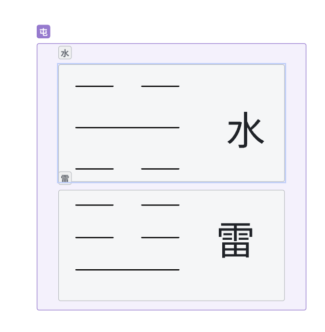
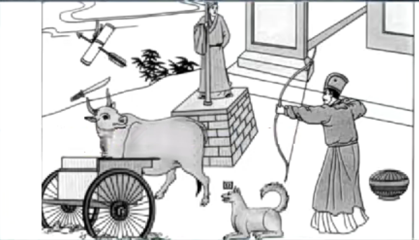

# 屯卦详解

**水雷屯**：**物之始生——遇到屯的时候代表不了解状况、不亨通。**

天地定位后(有天有地后，所有世界上的万物都是夹在天地之间),第一个象就是屯

**阴阳刚交为屯**

**阴阳相交后为解**

**阴阳不交为否**

# 卦、爻

卦-->事

爻-->事的时机

# 符号

## 卦体

**水代表险、雷代表动**

**外险内动——心中想动，但是外面危险**

做法——保持坚心，待时而动，以明而动，不明而动则动于险中。

**要利建侯**：**广结善缘、找支持的人。**

# **水雷屯**

## 九一

要**盘恒、利居贞，利建侯**、与周围的人结善缘，建立自己做事的原则；

**以贵下贱、大得民也**

## 六二

**屯如邅如 乘马班如 匪寇 婚媾 女子贞不字，十年乃字**

下面是刚，刚来还处于屯，被逼为难、

寇：非理而至。

婚媾 被逼结婚

十是数字里最大的数字。

**被逼为难、不要动，错误的决定十年才能回头**

## 六三

**即鹿无虞，唯入于林中，君子几不如舍，往吝**

吝（悔恨，灾）

**你的好建议没有办法被上司接纳、舍掉、不要越级**

## 六四

**乘马班如 求婚媾 往吉，无不利**

**发现贤人来辅佐你、不要太相信自己的能力**

## 九五

**屯其膏 小贞吉 大贞凶**

政令无法下达:代表权利移转，大改革必凶。改小，温水煮青蛙

**问鼎轻重者，必叛，要履坚冰霜**

**小变革吉、大改革凶**

## 上六

**乘马班如 泣血涟如**

**阴柔居屯之极**

险极又没有救援，**用贤**—阳刚之人乃解，否则泣血涟如

# **卦图象解**

1、**不明局势，不可妄动，去广结善缘**； (人在望杆头上观望）

2、**结果是悲伤的象、肖狗的人、狄姓的人**；（犬上有回字）

3、**进退两难，肖牛的人为贵人；**     （车在泥中，刀在牛上）

4、**张姓的人、有小人阻碍、有桃色绯闻**； （人在射文书，拉弓藏身而射）

5、**卜疾厄人亡；** （有人在望）

6、**在位的人；** （人立在那里）

7、**如果妄动、先成后破；**  （盒子）

8、**计无所出、等待**。——**动于险中，先成后破**。 （牛转头看狗）

#  范蠡经商

**人弃我捡、人争我弃**。

# 阳宅

**次子居长子位，屯卦现**，会**背道而驰**，越位了，同一个屋檐下，才有这种情况。

若长子结婚，则次子补，长子住西北，父母住东南（三儿子的位置，天山屯卦，屯（退隐），长子会孝顺父母，对父母有耐心

