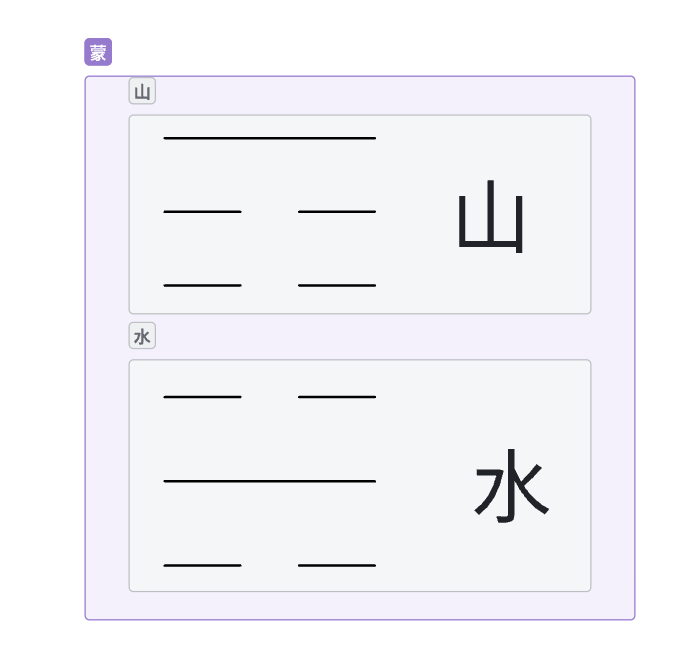

# 蒙卦详解

**山水蒙：外止内险。人需要童蒙（赤子之心），多问。**

屯之后就有智慧了，要启蒙

**匪我求童蒙，童蒙求我，初筮告，再三渎，渎则不告，利贞**
<!-- truncate -->

# 符号

## 卦体

**山下有水，遇险而止，莫知所之，蒙**

山-->止

水-->险

**外止内险，不知道怎么办，停下来，要去多问，问懂的人**

# 蒙
内心不知道怎么办，停下来，这就是蒙
## 童蒙
童蒙是最好的，不懂就问，去请教

## 渎蒙
已经成为蒙了，认为自己是永远是对的
## 蒙蔽
就是说对你有所企图
## **去蒙之道（待时机）**
必**待诚心一致来求己**，再告知，方能去蒙，必以贞正（**保持原则一致**）。
## 国来看
发民之蒙，必以刑禁，立法为先。蒙致极，利用寇，当击伐（教训）之——适中。
# 面相
双目似睁未睁，两眼无神——**蠢**。

# 卦象

1、有小禄也；  （有个鹿

2、忧心忡忡；   （地下两串钱

3、姓李有子夭折；  （李树有枝折

4、先成后破；  （一个盒子

5、人图财之象； （有两个人在船上，船上有珍宝，虽然陆地上有禄，

6、离国他去；
