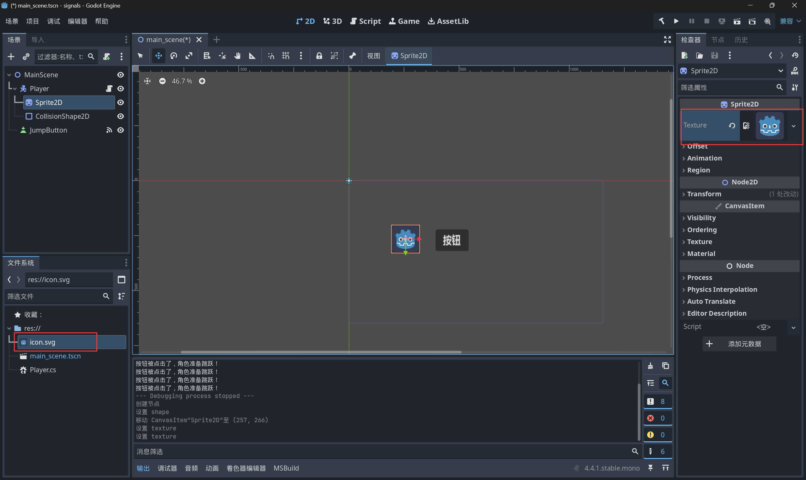
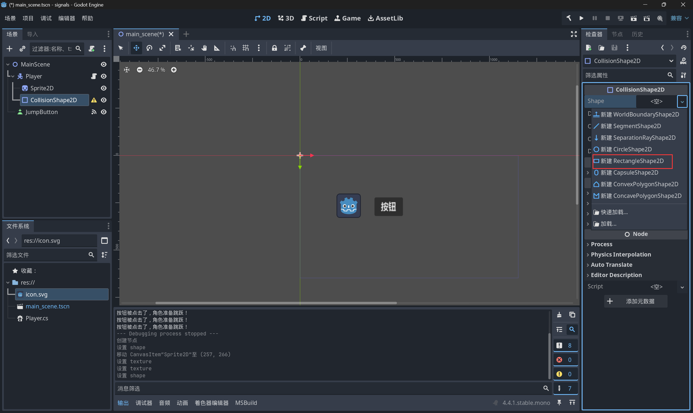
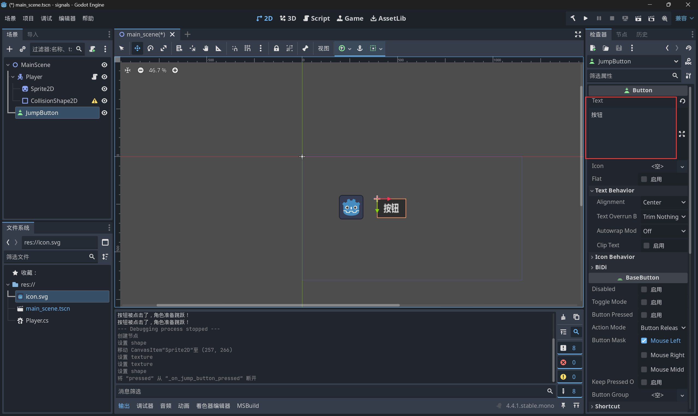
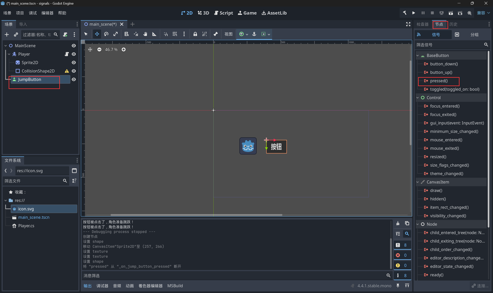
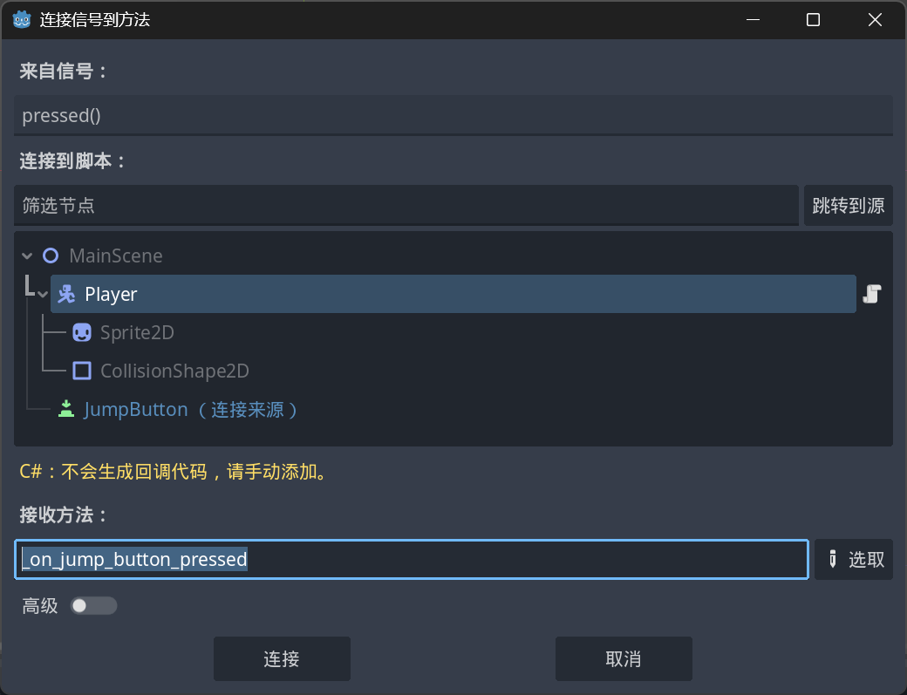
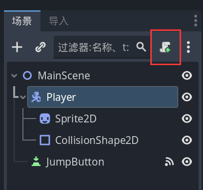
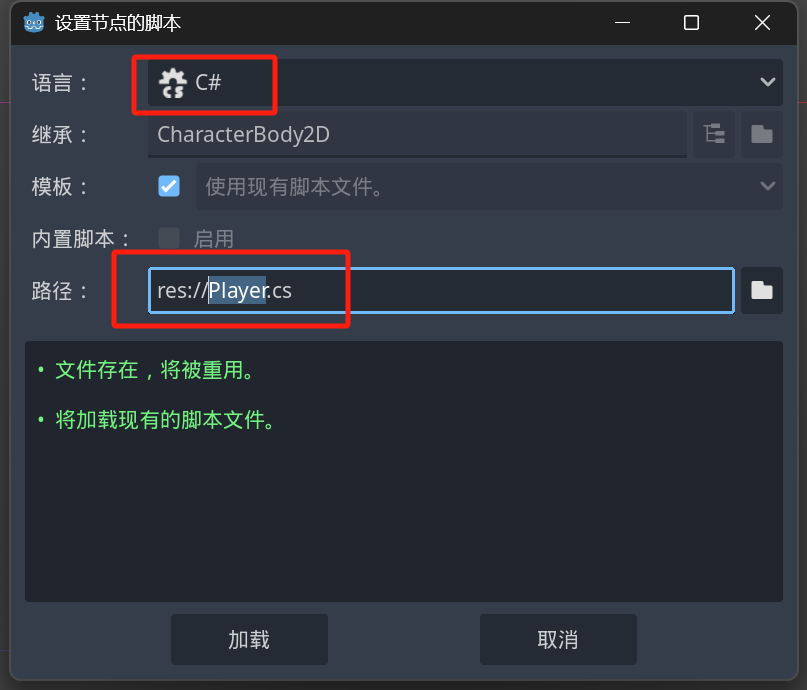
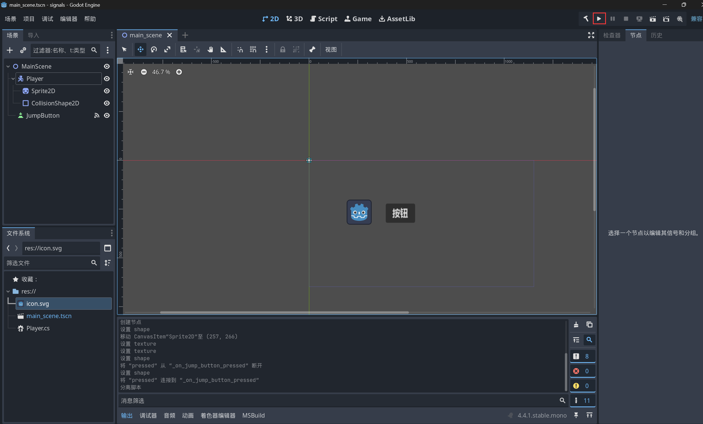
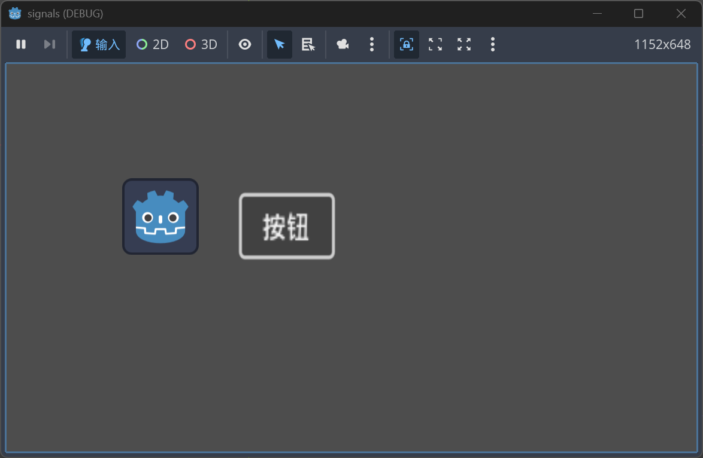

# 节点之间的通信：信号（Signals）

------

## 1. 什么是信号（Signal）？

**信号**就是一种**消息通知机制**，
 允许一个节点在发生某些事情时，通知其他节点。

✅ 信号是**松耦合**的，发送者不需要知道接收者是谁，只负责广播。

------

**🧱 理解比喻**

想象：

- 一个按钮节点就像一个广播站。
- 当按钮被按下时，它发出广播：「我被按了！」
- 其他节点（比如玩家角色）只要**订阅**了这个广播，就能立刻收到通知，并采取行动（比如跳起来）。

------

## 2. 为什么需要信号？

- 传统直接调用函数：

  - A节点必须知道B节点存在 ➔ 紧耦合 ➔ 扩展困难

  使用信号：

  - A节点只发广播，不管有没有人接收 ➔ 松耦合 ➔ 结构清晰、维护容易

  ✅ 比如：玩家靠近门口，Area2D只需要广播「有人进来了」，不用关心是谁接收。

------

## 3. Godot 信号的使用步骤

| 步骤 | 动作             | 示例                                 |
| ---- | ---------------- | ------------------------------------ |
| 1    | 定义信号（可选） | `signal health_depleted`             |
| 2    | 发送信号         | `EmitSignal("health_depleted")`      |
| 3    | 连接信号         | 在编辑器或代码里连接到其他节点的方法 |
| 4    | 响应信号         | 被连接的方法自动执行                 |

## 4. 最常用的内置信号

Godot自带很多节点的内置信号，比如：

| 节点类型 | 信号           | 含义               |
| -------- | -------------- | ------------------ |
| Button   | `pressed()`    | 按钮被点击         |
| Area2D   | `body_entered` | 有物体进入检测区域 |
| Timer    | `timeout()`    | 定时器时间到       |

## 5. 信号实际例子（结合Godot界面）

------

为了更好理解，我们用一个最常见的实际场景：

> **【例子：玩家点击按钮后，让角色跳跃】**

### 📌 第一步：搭建场景（含角色内部结构）

1. 创建一个新场景，根节点是 `Node2D`，命名为 `MainScene`。
2. 添加两个子节点：
   - 一个 `Button` 节点，命名为 `JumpButton`
   - 一个 `CharacterBody2D` 节点，命名为 `Player`
3. **继续给 Player 添加两个子节点：**
   - `Sprite2D` ➔ 显示角色的图像
   - `CollisionShape2D` ➔ 定义角色的碰撞边界

最终的场景树结构如下：

```scss
MainScene (Node2D)
 ├── JumpButton (Button)
 └── Player (CharacterBody2D)
      ├── Sprite2D
      └── CollisionShape2D
```

**🔍 解释：**

- **Sprite2D**：
  - 用来展示角色图像（贴图）
  - 需要在右侧 `Texture` 属性里加载一张角色 PNG 图片(这里我们拖动icon.svg到Texture)
- **CollisionShape2D**：
  - 必须添加一个形状（例如 `RectangleShape2D`，形状应贴合角色，大小一般是比我们角色小一点）
  - 没有这个，角色无法与地面碰撞，`MoveAndSlide()` 也不会生效
  - （其实有没有CollisionShape2D无所谓，因为我们这次demo不牵扯碰撞🤣，我写的原因是正常项目还是会牵扯到碰撞，当学习了

✅ 所以 Player 需要这两个子节点才能“看得见 + 碰得到 + 跳得起”。








---

### 📌 第二步：用 Godot 编辑器连接信号（如果没有脚本，就顺便创建）

1. **选中 `JumpButton` 节点**
2. 打开右边「节点（Node）」面板
3. 找到 `pressed()` 信号
4. 右键点击 ➔ 选择「连接（Connect）」
5. 在弹出的窗口：
   - 【接收节点（Receiver）】选择 `Player`
6. 如果 `Player` 还**没有挂脚本**，Godot 会提示你需要创建脚本：
   - 选中`Player`节点
   - 点击「附加脚本（Attach Script）」
   - 跳出新建脚本窗口：
     - 路径一般是 `res://Player.cs`
     - 语言选择 C#
     - 父类默认是 `CharacterBody2D`
   - 点击「创建（Create）」
   - 返回上面创建信号步骤

✅ Godot 会自动在 `Player` 的脚本里生成一个方法框架（c#没有，需要手动创建）！

在脚本中创建代码为

```c#
// 名字与创建信号的名字要一致	
private void _on_jump_button_pressed()
{
		
}
```









------

### 📌 第三步：在 Player 脚本里填写跳跃逻辑


```c#
using Godot;
using System;


/// <summary>
///  玩家角色控制脚本，负责处理跳跃和重力逻辑,继承自 CharacterBody2D。
///  CharacterBody2D 是 Godot 专门给2D角色运动用的节点类型，可以自动处理物理、碰撞。
/// </summary>
public partial class Player : CharacterBody2D
{
    // 跳跃速度（负号代表向上跳, 在 Godot 的2D坐标系里，Y轴向下是正方向，向上是负方向）。
    public const float JumpVelocity = -400.0f;
    
    // 角色当前速度
    Vector2 velocity = Vector2.Zero;
    

    public override void _PhysicsProcess(double delta)
    {
       velocity += GetGravity() * (float)delta;
       Velocity = velocity;
       MoveAndSlide();
    }
    
    /// <summary>
    ///  当跳跃按钮被按下时调用，触发角色跳跃动作。
    /// </summary>
    private void _on_jump_button_pressed()
    {
       GD.Print("按钮被点击了，角色准备跳跃！");
       velocity.Y = JumpVelocity;
       
    }
}
```

详解：

#### 1. 类定义部分

```c#
using Godot;
using System;

public partial class Player : CharacterBody2D
{
```

✅ 意思是：

- 使用 Godot 的核心库 (`using Godot;`)。
- 定义了一个 C# 类 `Player`，继承自 `CharacterBody2D`。
- `partial` 表示这个类可能会和Godot引擎底层一起补充（Godot4规范）。

`CharacterBody2D` 是 Godot 专门给2D角色运动用的节点类型，可以自动处理物理、碰撞。

------

#### 2. 定义跳跃速度

```c#
// 跳跃速度（向上）
public const float JumpVelocity = -400.0f;
```

✅ 意思是：

- 定义一个**常量**，叫做 `JumpVelocity`，值是 `-400`。
- 负号代表**向上跳**（在 Godot 的2D坐标系里，Y轴向下是正方向，向上是负方向）。

比如：

- `velocity.Y = -400` 就意味着角色瞬间获得一个向上的初速度。

------

#### 3. 定义角色速度变量

```c#
// 角色当前速度
Vector2 velocity = Vector2.Zero;
```

✅ 意思是：

- 创建了一个 2D 向量 `velocity`，初始值是 `(0, 0)`。
- 这个 `velocity` 代表角色当前的速度（包括水平速度和垂直速度）。
- 后面跳跃、下落都是通过修改这个 `velocity`。

---

#### 4.每帧更新物理逻辑

```c#
public override void _PhysicsProcess(double delta)
{
	velocity += GetGravity() * (float)delta;
	
	Velocity = velocity;
	MoveAndSlide();
}
```

✅ 详细解释：

| 行                                         | 含义                                                         |
| ------------------------------------------ | ------------------------------------------------------------ |
| `velocity += GetGravity() * (float)delta;` | 每一帧给速度增加**重力**，让角色有下落的感觉                 |
| `Velocity = velocity;`                     | 把自己维护的速度传给 `CharacterBody2D` 内置的 `Velocity` 变量 |
| `MoveAndSlide();`                          | Godot 帮你根据速度移动角色，并自动处理碰撞                   |

🔵 小补充：

- `GetGravity()` 是 `CharacterBody2D`自带的方法，它返回游戏世界设定的重力（比如900）。
- `delta` 是帧间隔时间，乘以 delta 是为了**保持不同帧率下动作平滑**（标准写法）。

**➔ 这段逻辑的作用是：**

- 角色在没有跳跃的情况下，每帧受到重力，自动向下掉。

---

#### 5. 按下按钮时触发跳跃

```c#
private void _on_jump_button_pressed()
{
	GD.Print("按钮被点击了，角色准备跳跃！");
	velocity.Y = JumpVelocity;
}
```

✅ 详细解释：

| 行                                          | 含义                                        |
| ------------------------------------------- | ------------------------------------------- |
| `_on_jump_button_pressed()`                 | 这是接收 JumpButton 的 pressed() 信号的函数 |
| `GD.Print("按钮被点击了，角色准备跳跃！");` | 打印一条提示信息到Godot控制台               |
| `velocity.Y = JumpVelocity;`                | 给角色一个向上的速度，产生跳跃效果          |

---

### 🎯 这一套逻辑串起来是这样的：

1. 每帧自动加重力 ➔ 角色自然下落
2. 当玩家点击按钮时 ➔ 给一个向上的速度
3. 速度变化 ➔ 角色跳起来
4. MoveAndSlide() ➔ 根据速度移动角色，并处理地面的碰撞

---

### ✅运行测试

点击运行按钮，再界面测试即可





## 📚 小提醒

- **JumpButton** 只负责发出「pressed」信号，不自己执行跳跃动作。
- **Player** 负责接收信号并响应（跳跃）。
- 角色跳跃本质是：
   ➔ 给 Y 轴方向加一个负速度，然后通过 MoveAndSlide() 让角色跳起来。

---

## ✅ 小总结

| 内容                 | 说明                                                         |
| -------------------- | ------------------------------------------------------------ |
| 发射信号             | Button 节点通过 pressed() 信号发出点击事件                   |
| 接收信号             | Player 节点接收 pressed() 信号并响应（执行跳跃逻辑）         |
| 跳跃实现             | 修改 Player 的 velocity，使用 MoveAndSlide() 让角色跳跃      |
| Sprite2D作用         | Sprite2D用于显示角色的外观，需要指定贴图 Texture             |
| CollisionShape2D作用 | CollisionShape2D定义角色的物理碰撞范围，虽然本例可以不加，但正式项目中必须有 |
| 测试运行流程         | 点击界面上的运行按钮，进入场景测试角色跳跃效果               |

---

✅ 本章小结核心要点：

- 节点通信通过「信号机制」完成，松耦合设计，结构清晰。
- 角色节点需要搭配 Sprite2D（外观）+ CollisionShape2D（碰撞）才能正常完整。
- 连接信号时，接收节点需要挂载脚本并手动实现响应方法（C#）。
- 逻辑开发完成后，需要运行测试确认实际效果。

## 📖 小练习：信号与跳跃机制复习题

------

### 1. 单选题（基础理解）

**Q1**：在 Godot 中，哪个节点主要负责「发出按下信号」？

- A. Sprite2D
- B. Button
- C. Player
- D. Node2D

<details> 
    <summary>✅ 答案</summary> 
    <p>B. Button 发出 pressed() 信号，通知其他节点。</p> 
</details>

------

**Q2**：如果没有给 `Player` 节点添加 `CollisionShape2D`，可能会出现什么问题？

- A. 角色无法跳跃
- B. 角色无法移动
- C. 角色无法检测到地面，跳跃后会一直下落
- D. 游戏崩溃

<details>
    <summary>✅ 答案</summary> 
    <p>C. 角色可以跳，但无法检测到地面，会不断下落，不会碰撞到地面。 </p> 
</details>

------

### 2. 判断题（理解应用）

**Q3**：在 Godot 2D 世界中，Y轴向上的方向是负的。

- ✅ 正确
- ❌ 错误

<details> 
    <summary>✅ 答案</summary> 
    <p>✅ 正确。Godot 的2D坐标系是：右（X+），下（Y+），上是负方向。</p> </details>

------

**Q4**：`MoveAndSlide()` 函数可以在没有 Velocity 赋值的情况下自己完成角色运动。

- ✅ 正确
- ❌ 错误

<details> 
    <summary>✅ 答案</summary>
    <p>❌ 错误。MoveAndSlide() 依赖 Velocity。没有赋 Velocity，角色不会动。</p> </details>

------

### 3. 简答题（加深理解）

**Q5**：简要说明为什么在连接信号时，Player 节点必须挂载脚本？

<details> 
    <summary>✅ 答案参考</summary>
    <p> 因为 Godot 信号机制需要在接收节点中生成回调方法（例如 _on_jump_button_pressed()）， 而没有脚本就无法创建方法，自然也无法响应信号事件。 </p> 
</details>

**Q6**：如果想让角色只在落地时才能跳跃，需要在跳跃代码中增加什么逻辑判断？（提示：关键词 IsOnFloor,自行扩展）

<details>
<summary>✅ 答案参考</summary>
<p>应该在 _on_jump_button_pressed() 方法中，加一层判断：</p>
<pre><code>if (IsOnFloor())
{
    velocity.Y = JumpVelocity;
}
</code></pre>
<p>只有当角色检测到落在地面上时，才允许跳跃，防止连续空中跳。</p>
</details>


## 🧠 进阶思考题

------

**Q1**. 如何实现【按住按钮不松开，角色持续跳跃】？

提示：

- 现在我们的 `_on_jump_button_pressed()` 只处理「按下瞬间」。
- 如果要让角色按住键不松，就一直跳，该怎么修改？需要用什么新方法？
<details>
<summary>✅ 答案参考</summary>
<pre><code>
 public const float JumpVelocity = -400f;
public override void _PhysicsProcess(double delta)
{
    Vector2 v = Velocity;              // 当前速度
    /* 重力：不在地面就向下加速 */
    if (!IsOnFloor())
        v += GetGravity() * (float)delta;
    /* 连续跳：键被按住且角色在地面时起跳 */
    if (Input.IsActionPressed("ui_jump") && IsOnFloor())
        v.Y = JumpVelocity;            // 赋负值向上跳
    Velocity = v;
    MoveAndSlide();                    // 执行移动
}
</code></pre>
<p><strong>关键点</strong></p>
<ul>
  <li>使用 <code>Input.IsActionPressed()</code> → 只要键持续按下，检测就会在每一帧触发。</li>
  <li>加上 <code>IsOnFloor()</code> → 只有落地那一帧才重新起跳，避免空中无限连跳。</li>
  <li>其余水平移动、冷却计时等功能可按需要再补；</li>
</ul>
</details>


------

**Q2**. 如何实现【双段跳（Double Jump）】功能？

要求：

- 玩家在空中还能再跳一次
- 只能跳两次，落地后重置

提示：

- 需要新增变量记录「跳跃次数」。

<details>
<summary>✅ 答案参考</summary>
<p><strong>解决思路</strong>：增加一个变量 <code>jumpsLeft</code> 来记录“本轮还能跳几次”。</p>
<ul>
<li><p>初始值设为 <code>2</code>（双段跳）。</p></li>
<li><p>每次检测到 <code>Input.IsActionJustPressed("ui_jump")</code> 且 <code>jumpsLeft &gt; 0</code> 时：  
&nbsp;&nbsp;① 赋值 <code>JumpVelocity</code> → 起跳  
&nbsp;&nbsp;② <code>jumpsLeft--</code> → 扣一次次数</p></li>
<li><p>当角色落地（<code>IsOnFloor()</code> 为 <code>true</code>）时，把 <code>jumpsLeft</code> 重置回 <code>2</code>。</p></li>
</ul>
<p><strong>最小化示例代码</strong>（只演示双段跳核心逻辑）：</p>
<pre><code>
public partial class Player : CharacterBody2D
{
    public const float JumpVelocity = -400f;
    private int jumpsLeft = 2;              // 双段跳：可跳 2 次
    public override void _PhysicsProcess(double delta)
    {
        Vector2 v = Velocity;
        /* 重力 */
        if (!IsOnFloor())
            v += GetGravity() * (float)delta;
        /* 起跳逻辑 —— 只要还有次数就能跳 */
        if (Input.IsActionJustPressed("ui_jump") && jumpsLeft > 0)
        {
            v.Y = JumpVelocity;             // 起跳
            jumpsLeft--;                    // 次数 -1
        }
        /* 落地后重置跳跃次数 */
        if (IsOnFloor())
            jumpsLeft = 2;
        Velocity = v;
        MoveAndSlide();
    }
}
</code></pre>
<p><strong>关键点</strong>：</p>
<ul>
<li><p><code>jumpsLeft</code> 控制最多跳两次；要三段跳只需把初始值改为 3。</p></li>
<li><p>检测键盘用 <code>IsActionJustPressed</code>，避免长按时一帧消耗多次跳权。</p></li>
<li><p>落地判定后立即归位，实现“着陆 → 次数刷新”。</p></li>
</ul>
</details>


​    


