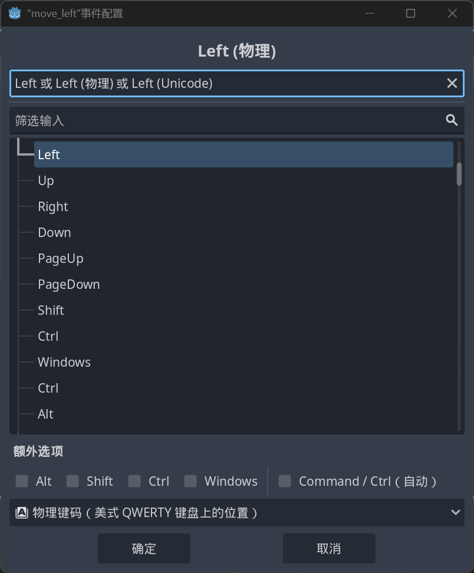

# 输入系统与控制逻辑

## 🎯 学完你将掌握：

- 如何使用 **Input Map** 定义自定义动作
- 如何用 C# 处理玩家输入
- 如何实现角色：
  - ✅ 左右移动
  - ✅ 跳跃
  - ✅ 冲刺（拓展）
  - ✅ 攻击（拓展）
- 如何通过代码控制动画状态（基础）

------

## 1️⃣ 设置输入映射（Input Map）

打开：**项目→项目设置→ 输入映射名称→绑定事件**
 依次添加这些自定义动作名：

| 动作名       | 推荐绑定键    |
| ------------ | ------------- |
| `move_left`  | A / ←         |
| `move_right` | D / →         |
| `jump`       | Space / ↑ / W |
| `attack`     | J / Ctrl      |
| `sprint`     | Shift         |


该页面按动键盘即可绑定




## 2️⃣ 角色节点结构（最小结构）

我们仅用 **3 个节点** 完成控制逻辑：

```scss
Main (Node2D)                # 游戏主节点
├── Player (CharacterBody2D)  # 玩家角色
│   ├── Sprite2D              # 玩家外观图像
│   └── CollisionShape2D      # 玩家碰撞体（矩形）
└── Ground (StaticBody2D)     # 地面
    └── CollisionShape2D      # 地面碰撞体（WorldBoundaryShape2D）
```

### 🧱 节点说明

#### 🟦 Player 角色

- 使用 `CharacterBody2D` 可实现自定义移动和重力控制
- 搭配 `MoveAndSlide()` 使用，支持：
  - `IsOnFloor()` 落地检测
  - `Velocity` 控制方向和速度
- 子节点：
  - `Sprite2D` 用于显示角色图像
  - `CollisionShape2D` 使用 `RectangleShape2D` 作为基础碰撞体

#### 🟫 Ground 地面

- 使用 `StaticBody2D` 表示不可移动的地面
- 碰撞体选择 `WorldBoundaryShape2D`，形成一条无限的水平边界线

> ✅ 使用 `WorldBoundaryShape2D` 可快速构建一个“无限延伸”的地面，非常适合角色在 X 轴上测试移动行为。只需将其挂载在 `StaticBody2D` 的 `CollisionShape2D` 上，并确保法线朝上（蓝色箭头朝上），角色即可稳定站立并自由行走，无需拼接平台。

💡 小提示：

- `WorldBoundaryShape2D` 是无厚度的一维碰撞线，节省性能、适合测试
- 法线方向朝上才能阻挡角色向下坠落
- 后期游戏中如需地形可见或有视觉表现，可替换为 ` TileMapLayer` + `RectangleShape2D`

## 3⃣ 创建 Player 脚本（使用模板推荐）

1. 选中 Player 节点
2. 点击“添加脚本”
3. 选择：
   - 语言：C#
   - 继承：CharacterBody2D
   - 模板：`CharacterBody2D: Basic Movement`

📷 模板选择示意图：


---

## 4⃣ 脚本内容解析（自动生成版）

以下是使用模板 `CharacterBody2D: Basic Movement` 自动生成的 C# 控制脚本。它为平台类游戏角色提供了**基础控制功能**：重力、跳跃、左右移动。

```c#
using Godot;
using System;

public partial class Player : CharacterBody2D
{
    public const float Speed = 300.0f;
    public const float JumpVelocity = -400.0f;

    public override void _PhysicsProcess(double delta)
    {
        Vector2 velocity = Velocity;

        // 添加重力
        if (!IsOnFloor())
        {
            velocity += ProjectSettings.GetSetting("physics/2d/default_gravity").AsSingle() * Vector2.Down * (float)delta;
        }

        // 处理跳跃
        if (Input.IsActionJustPressed("ui_accept") && IsOnFloor())
        {
            velocity.Y = JumpVelocity;
        }

        // 处理左右移动
        Vector2 direction = Input.GetVector("ui_left", "ui_right", "ui_up", "ui_down");
        velocity.X = direction.X * Speed;

        Velocity = velocity;
        MoveAndSlide();
    }
}
```

### 🔍 逐段解释

#### ✅ `public partial class Player : CharacterBody2D`

- 类 `Player` 继承 `CharacterBody2D`，这是 Godot 为带物理控制的角色设计的节点。
- `partial` 是 Godot 4 的必要修饰符，用于配合自动生成的 C# glue 绑定代码。

#### ✅ `Speed` 与 `JumpVelocity`

- `Speed` 控制水平移动速度（越大移动越快）
- `JumpVelocity` 是跳跃速度，**为负值**，表示向上跳（Y轴向下为正）

#### ✅ `_PhysicsProcess(double delta)`

- Godot 中每帧的**物理处理函数**，用于更新角色速度与位置
- `delta` 表示两帧之间的时间间隔，确保不同帧率下行为一致

---

### ⚖️ 重力逻辑

```c#
if (!IsOnFloor()) {
    velocity += gravity * delta;
}
```

- 使用 `ProjectSettings.GetSetting(...)` 动态读取引擎设定的重力值
- 仅当角色**未接触地面**时才施加重力，防止不断下沉

------

### 🪂 跳跃处理

```c#
if (Input.IsActionJustPressed("ui_accept") && IsOnFloor()) {
    velocity.Y = JumpVelocity;
}
```

- 使用 `IsOnFloor()` 保证只有在地面上才能起跳
- `ui_accept` 默认绑定为 `空格键`，可在 Input Map 中修改

------

### 🕹️ 移动方向处理

```c#
Vector2 direction = Input.GetVector("ui_left", "ui_right", "ui_up", "ui_down");
velocity.X = direction.X * Speed;
```

- `Input.GetVector(...)` 是 Godot 推荐的方式：
  - 左键按下返回 -1，右键按下返回 1
  - 可用于 2D 移动、8 向移动、手柄摇杆统一控制

------

### ➕ 应用速度并移动

```c#
Velocity = velocity;
MoveAndSlide();
```

- 将修改后的速度赋值给 `Velocity`（内建属性）
- `MoveAndSlide()` 是核心移动函数，自动处理：
  - 地面/墙面碰撞
  - 滑动与阻挡
  - `IsOnFloor()` 状态更新

### ✅ 总结功能列表

| 功能     | 行为说明                                                  |
| -------- | --------------------------------------------------------- |
| 水平移动 | 支持按 A/D 或 ←/→ 进行左右移动                            |
| 跳跃     | 仅在接触地面时按空格可起跳                                |
| 重力     | 空中状态下持续向下加速，模拟自由落体                      |
| 碰撞检测 | 使用 `MoveAndSlide()` 自动处理角色与地面/墙壁交互         |
| 输入控制 | 使用 `Input.GetVector()` 和 `Input.IsActionJustPressed()` |

---

## 5⃣ 修改脚本绑定自定义映射

```c#
		...		
        if (Input.IsActionJustPressed("jump") && IsOnFloor())
        {
            velocity.Y = JumpVelocity;
        }

        if (Input.IsActionJustReleased("attack") && IsOnFloor())
        {
            GD.Print("攻击动作触发");
        }

        float speedMultiplier = Input.IsActionPressed("sprint") ? 1.5f : 1.0f;

        Vector2 direction = Input.GetVector("move_left", "move_right", "ui_up", "ui_down");
        if (direction != Vector2.Zero)
        {
            velocity.X = direction.X * Speed * speedMultiplier;
        }
        else
        {
            velocity.X = Mathf.MoveToward(Velocity.X, 0, Speed);
        }
		...
```

### ✏️ 改动说明

我们对自动生成的基础模板脚本进行了如下改动：

#### ✅ 1. 将默认跳跃键 `"ui_accept"` 替换为自定义 `"jump"`：

```c#
if (Input.IsActionJustPressed("jump") && IsOnFloor())
{
    velocity.Y = JumpVelocity;
}
```

> 💡 对应 Input Map 中自定义的 `"jump"` 动作，绑定空格键或 W。

------

#### ✅ 2. 添加攻击动作触发逻辑：

```c#
if (Input.IsActionJustReleased("attack") && IsOnFloor())
{
    GD.Print("攻击动作触发");
}
```

- 当玩家**松开**攻击键（例如 J）时触发事件。
- `IsActionJustReleased()` 用于侦测“松开瞬间”。
- 可以在后续改为播放攻击动画或触发伤害判定。

------

#### ✅ 3. 添加冲刺倍率控制：

```c#
float speedMultiplier = Input.IsActionPressed("sprint") ? 1.5f : 1.0f;
```

- 如果按住冲刺键（如 Shift），则将移动速度提高为 1.5 倍。
- 否则保持正常速度。
- 冲刺倍率将用于后续的 `velocity.X` 计算中。

------

#### ✅ 4. 修改移动方向逻辑，使用自定义动作名：

```c#
Vector2 direction = Input.GetVector("move_left", "move_right", "ui_up", "ui_down");
```

- 替换原来的 `ui_left` / `ui_right` 为我们自定义的 `move_left` / `move_right`。
- 注意：如果你没定义 `ui_up` / `ui_down`，可以只处理 `X` 方向，写成：

```c#
float direction = 0.0f;
if (Input.IsActionPressed("move_left")) direction -= 1;
if (Input.IsActionPressed("move_right")) direction += 1;
```

------

#### ✅ 5. 应用移动 + 减速逻辑：

```c#
if (direction != Vector2.Zero)
{
    velocity.X = direction.X * Speed * speedMultiplier;
}
else
{
    velocity.X = Mathf.MoveToward(Velocity.X, 0, Speed);
}
```

- 如果有方向输入，则移动
- 如果松开方向键，则使用 `Mathf.MoveToward()` 缓慢减速回 0（模拟惯性）

---

## 6⃣ 小结

> 通过本章，你已学会：
>
> - 使用 Input Map 绑定自定义按键
> - 使用 CharacterBody2D 构建可控制角色
> - 使用 WorldBoundaryShape2D 构造地面或边界
> - 使用 Godot 内置脚本模板快速开始

---

快来动手，试试吧