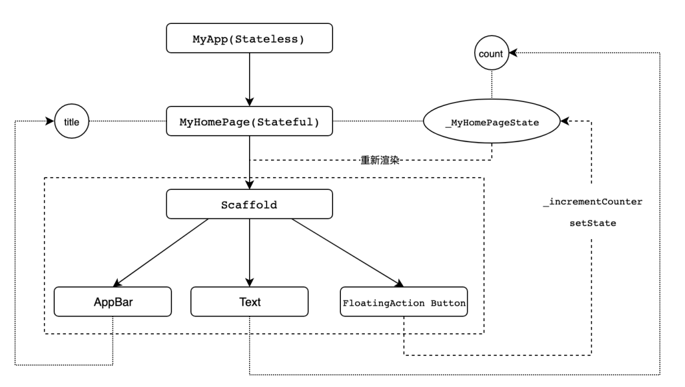

# 1. Flutter 项目结构
当你创建一个新的 Flutter 项目时，你会看到以下的目录结构：
```bash
my_flutter_app/
├── android/
├── build/
├── ios/
├── lib/
│   └── main.dart
├── test/
├── .gitignore
├── .metadata
├── pubspec.yaml
└── README.md
```
主要目录和文件说明：

* android/ 和 ios/: 这两个目录分别包含了 Android 和 iOS 平台的原生项目代码。Flutter 通过这些原生项目来与 Android 和 iOS 进行交互。
* 
* android/ 目录包含 Gradle 构建文件和 Android 原生代码。
* 
* ios/ 目录包含 Xcode 项目文件和 iOS 原生代码。
* 
* lib/: 这是你的 Flutter 应用的主要代码库。你所有的 Dart 代码都在这里。默认情况下，会有一个 main.dart 文件，作为应用的入口文件。
* 
* build/: 这个目录是构建输出的目录。你不需要手动修改这里的文件，Flutter 会自动生成构建输出。
* 
* test/: 这个目录包含应用的测试代码。你可以在这里编写单元测试、Widget 测试和集成测试。
* 
* pubspec.yaml: 这是 Flutter 项目的配置文件。你可以在这里管理项目的依赖、资源文件（如图片、字体）和其他配置。
* 
* .gitignore: 这个文件列出了应该被 Git 忽略的文件和目录。
* 
* README.md: 这个文件通常包含项目的简介和使用说明。

# 2. Flutter 代码结构与实现
```dart
import 'package:flutter/material.dart';

void main() => runApp(MyApp());

class MyApp extends StatelessWidget {
  @override
  Widget build(BuildContext context) {
    return MaterialApp(
      title: 'Flutter Demo',
      theme: ThemeData(
        primarySwatch: Colors.blue,
      ),
      home: MyHomePage(title: 'Flutter Demo Home Page'),
    );
  }
}

class MyHomePage extends StatefulWidget {
  MyHomePage({Key key, this.title}) : super(key: key);

  final String title;

  @override
  _MyHomePageState createState() => _MyHomePageState();
}

class _MyHomePageState extends State<MyHomePage> {
  int _counter = 0;

  void _incrementCounter() {
    setState(() {
      _counter++;
    });
  }

  @override
  Widget build(BuildContext context) {
    return Scaffold(
      appBar: AppBar(
        title: Text(widget.title),
      ),
      body: Center(
        child: Column(
          mainAxisAlignment: MainAxisAlignment.center,
          children: <Widget>[
            Text(
              'You have pushed the button this many times:',
            ),
            Text(
              '$_counter',
              style: Theme.of(context).textTheme.headline4,
            ),
          ],
        ),
      ),
      floatingActionButton: FloatingActionButton(
        onPressed: _incrementCounter,
        tooltip: 'Increment',
        child: Icon(Icons.add),
      ),
    );
  }
}
```
## 代码解析
本案例中要注意 **Flutter 的核心设计思想便是一切皆 Widget。**

### 1.应用入口 (main 函数)
```dart
void main() => runApp(MyApp());
```
- `main` 函数是应用的入口点，调用 `runApp` 函数来启动 `Flutter` 应用，并传入 `MyApp` 作为参数。
### 2.应用根组件 (MyApp 类)
```dart
class MyApp extends StatelessWidget {
  @override
  Widget build(BuildContext context) {
    return MaterialApp(
      title: 'Flutter Demo',
      theme: ThemeData(
        primarySwatch: Colors.blue,
      ),
      home: MyHomePage(title: 'Flutter Demo Home Page'),
    );
  }
}
```
- `MyApp` 类继承自 `StatelessWidget`，表示这是一个无状态的组件。
- `MaterialApp` 是一个 `Flutter` 提供的封装组件，包含了应用的许多基本配置，如主题、标题和主页。
### 3.主页组件 (MyHomePage 类)
```dart
class MyHomePage extends StatefulWidget {
  MyHomePage({Key key, this.title}) : super(key: key);

  final String title;

  @override
  _MyHomePageState createState() => _MyHomePageState();
}
```
- `MyHomePage` 类继承自 `StatefulWidget`，表示这是一个有状态的组件。
- `StatefulWidget` 需要实现 `createState` 方法，返回一个 State 对象，负责维护组件的状态。 
### 4.状态类 (_MyHomePageState 类)
```dart
class _MyHomePageState extends State<MyHomePage> {
  int _counter = 0;

  void _incrementCounter() {
    setState(() {
      _counter++;
    });
  }

  @override
  Widget build(BuildContext context) {
    return Scaffold(
      appBar: AppBar(
        title: Text(widget.title),
      ),
      body: Center(
        child: Column(
          mainAxisAlignment: MainAxisAlignment.center,
          children: <Widget>[
            Text(
              'You have pushed the button this many times:',
            ),
            Text(
              '$_counter',
              style: Theme.of(context).textTheme.headline4,
            ),
          ],
        ),
      ),
      floatingActionButton: FloatingActionButton(
        onPressed: _incrementCounter,
        tooltip: 'Increment',
        child: Icon(Icons.add),
      ),
    );
  }
}

```

- `_MyHomePageState` 类负责维护 `MyHomePage` 的状态。
- `int _counter = 0;` 定义了一个状态变量 `_counter`，用于记录按钮点击次数。
- `_incrementCounter` 方法通过 `setState` 方法更新状态，当状态发生变化时，`Flutter` 会重新构建UI。
- `build` 方法构建UI，使用了 `Scaffold` 组件来定义应用的基本结构，包括 `AppBar`、`Body` 和 `FloatingActionButton`。

### 流程图
