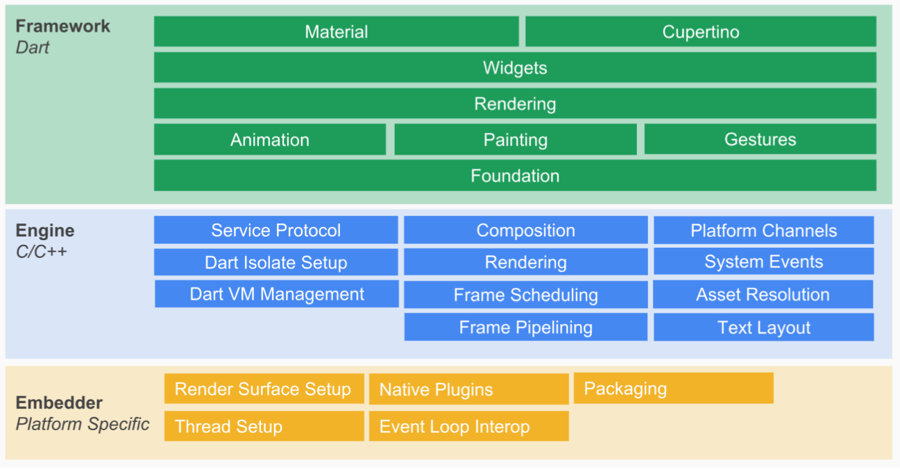
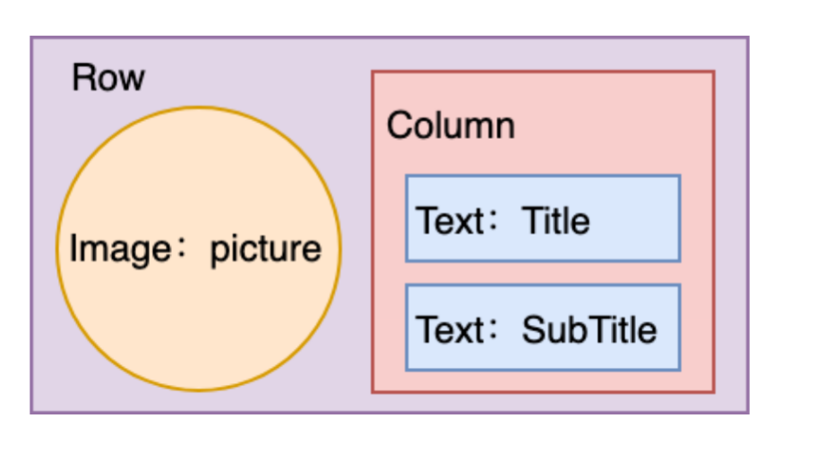
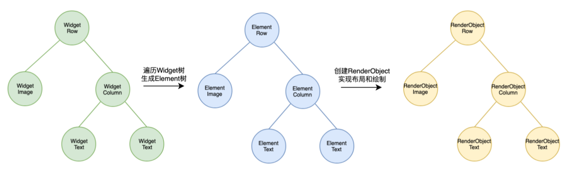

:::tip
我的评价是不要想太多, 知道即可, 这张笔记有点杂乱
:::

## Flutter 架构图


## Widget在Flutter中的作用
**在Flutter中，所有的元素都是Widget**，Widget是Flutter世界里对视图的一种结构化描述，是控件实现的基本逻辑单位。我们可以将Widget理解为前端中的“组件”。Widget存储的是视图渲染的配置信息，包括布局、渲染属性、事件响应等。

## Widget的基本类型
Flutter中有两种基本类型的Widget：
- `StatelessWidget`：这是一个静态的`Widget`，它的状态在其生命周期内是不可变的。
- `StatefulWidget`：这是一个动态的`Widget`，它的状态在其生命周期内是可变的。

## Widget的渲染过程
在Flutter中，视图的渲染过程主要分为三个部分：`Widget`、`Element` 和 `RenderObject`。
### 1. Widget
   Widget是Flutter中的基本构建单元。它是一种视图描述，包含视图的配置信息，如布局、样式、事件处理等。在Flutter中，几乎所有的UI组件都是Widget，包括按钮、文本、布局容器等。Widget本身是不可变的，每次状态改变时，Flutter会创建新的Widget实例。

### 2. Element
   Element是Widget的实例化对象，承载了视图构建的上下文数据。它是连接结构化的配置信息到最终渲染的桥梁。Element树是对Widget树的一种具体实现，Element树中的节点对应于Widget树中的节点，但Element树是可变的。

#### Element的主要作用：
* 持有Widget的配置信息。
* 创建和管理RenderObject。
* 处理Widget树的变化，将变化反映到RenderObject树中。
### 3. RenderObject
   RenderObject负责具体的布局和绘制工作。它接收来自Element的配置信息，进行视图的布局计算和绘制操作。RenderObject树是最终用于渲染的树结构，包含了所有需要渲染的对象。

### RenderObjectWidget
前面我们介绍到`StatelessWidget` 和 `StatefulWidget` 只是用来组装控件的容器，并不负责组件最后的布局和绘制。

`RenderObjectWidget` 定义了一些方法来间接地管理 `RenderObject` 和 `Element`，但具体的创建与更新操作是在 `RenderObjectElement` 中进行的。下面我们详细解析这些方法。
```dart
abstract class RenderObjectWidget extends Widget {
  @override
  RenderObjectElement createElement();

  @protected
  RenderObject createRenderObject(BuildContext context);

  @protected
  void updateRenderObject(BuildContext context, covariant RenderObject renderObject);

  @protected
  void didUnmountRenderObject(covariant RenderObject renderObject) {}
}
```
1. `createElement`：
返回一个 `RenderObjectElement`，这个方法由子类实现，用于创建 `Element`。
2. `createRenderObject`：
返回一个 `RenderObject`，这个方法由子类实现，用于创建 `RenderObject`。
3. `updateRenderObject`：
更新 `RenderObject` 的属性，这个方法由子类实现，用于更新 `RenderObject` 的属性。
4. `didUnmountRenderObject`：
当 `RenderObject` 从树中移除时调用，可以在子类中重写这个方法以执行必要的清理工作。
###  RenderObjectElement
`RenderObjectElement` 继承自 `Element`，它负责 `RenderObject` 的具体创建和管理操作。
```dart
// RenderObjectElement 继承自 Element，是一种特殊类型的 Element，
// 它与 RenderObjectWidget 一起工作以管理 RenderObject。
abstract class RenderObjectElement extends Element {
  // 构造函数，接受一个 RenderObjectWidget 实例作为参数。
  RenderObjectElement(RenderObjectWidget widget) : super(widget);

  // 重写 widget getter 方法，将其强制转换为 RenderObjectWidget 类型。
  @override
  RenderObjectWidget get widget => super.widget as RenderObjectWidget;

  // 持有的 RenderObject 实例。
  RenderObject _renderObject;

  // mount 方法在元素首次插入到树中时调用。
  @override
  void mount(Element parent, dynamic newSlot) {
    super.mount(parent, newSlot);
    // 创建 RenderObject，并将其附加到渲染树上。
    _renderObject = widget.createRenderObject(this);
    attachRenderObject(newSlot);
    _dirty = false;
  }

  // update 方法在元素需要更新时调用。
  @override
  void update(RenderObjectWidget newWidget) {
    super.update(newWidget);
    // 更新 RenderObject 的属性。
    widget.updateRenderObject(this, _renderObject);
    _dirty = false;
  }

  // unmount 方法在元素从树中移除时调用。
  @override
  void unmount() {
    super.unmount();
    // 执行 RenderObject 的清理工作。
    widget.didUnmountRenderObject(_renderObject);
  }

  // performRebuild 方法在需要重建元素时调用。
  @override
  void performRebuild() {
    super.performRebuild();
    // 更新 RenderObject 的属性。
    widget.updateRenderObject(this, _renderObject);
  }

  // attachRenderObject 方法将 RenderObject 附加到渲染树上。
  void attachRenderObject(dynamic newSlot) {
    // 实现将 RenderObject 附加到渲染树的代码
  }

  // detachRenderObject 方法将 RenderObject 从渲染树上分离。
  void detachRenderObject() {
    // 实现将 RenderObject 从渲染树分离的代码
  }
}
```


### Widget详细步骤
#### Widget渲染过程的详细步骤：
 
1. Widget树构建：Flutter应用的起点是一个根Widget，通过递归调用其build方法，逐步构建整个Widget树。
2. Element树构建：Flutter框架会遍历Widget树，并为每个Widget创建一个对应的Element。Element树会保存Widget的配置信息，并在Element树中维护Widget实例。
3. RenderObject创建：Element根据Widget的配置信息，创建相应的RenderObject。RenderObject负责布局计算和绘制。RenderObject树中的节点对应于Element树中的节点。

#### 布局阶段：

* Flutter从根RenderObject开始，遍历整个RenderObject树，确定每个节点的位置和尺寸。
* 布局过程采用深度优先遍历方式，先布局子节点，再布局父节点。

#### 绘制阶段：
* 在布局完成后，Flutter再次从根RenderObject开始，遍历RenderObject树，调用每个节点的paint方法，将其绘制到屏幕上。
* 绘制过程同样采用深度优先遍历方式，先绘制子节点，再绘制父节点。

#### 合成和渲染：

* 绘制完成后，Flutter将各个RenderObject的绘制结果合成为一个位图，并提交给GPU进行最终的渲染。
* Flutter使用Skia图形库进行合成和渲染，这部分操作在Flutter的底层引擎中完成。

### 例子



## Widget、Element 和 RenderObject 的关系
### `Widget`：
* 不可变性：`Widget`本身是不可变的，每次配置变化时都会创建新的`Widget`实例。
* 描述性：`Widge`t仅用于描述UI的配置信息，不包含实际的渲染逻辑。

### `Element`：
* 持有`Widget`和`RenderObject`：`Element`持有`Widget`的配置信息，并负责创建和管理`RenderObject`。
* 管理生命周期：`Element`管理`Widget`和`RenderObject`的生命周期，包括创建、更新和销毁。
* 上下文数据：`Element`包含了视图构建的上下文数据，是连接`Widget`和`RenderObject`的桥梁。

### `RenderObject`：
* 布局和绘制：`RenderObject`负责具体的布局计算和绘制工作。
* 可变性：`RenderObject`是可变的，可以根据新的配置更新其属性。
* 高效渲染：`RenderObject`通过高效的布局和绘制算法，实现快速渲染。
###  Widget、Element 和 RenderObject 的关系

1. 一个Widget可以对应多个Element：
由于Widget是不可变的，每次配置变化都会创建新的Widget实例。当一个Widget被不同的父节点引用时，可能会产生多个Element实例，每个实例都持有这个Widget的配置。

2. 一个Element对应一个RenderObject：
每个Element都会创建并持有一个RenderObject，负责实际的布局和绘制工作。Element负责管理RenderObject的生命周期和属性更新。


