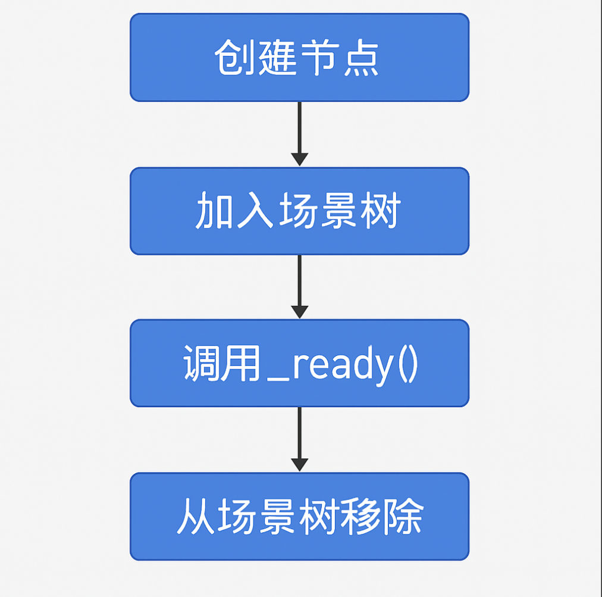

# 节点生命周期

## 1. 节点的生命周期是什么？

**生命周期**指的是：
 一个节点从**被创建** ➔ **开始运行** ➔ **被销毁**的整个过程。

✅ 理解生命周期，能让你知道**什么时候初始化数据**、**什么时候做逻辑处理**、**什么时候安全清理资源**。

------

## 2. Godot中节点生命周期的关键阶段

在 Godot 中，节点的生命周期主要分成这几个重要阶段：

| 生命周期方法              | 什么时候触发？                 | 用来做什么？                              |
| ------------------------- | ------------------------------ | ----------------------------------------- |
| `_ready()`                | 节点和它的子节点都加入场景树后 | 初始化，比如设置初始状态、连接信号        |
| `_process(delta)`         | 每一帧调用一次                 | 处理每一帧的逻辑，比如移动、检测输入      |
| `_physics_process(delta)` | 每一物理帧调用一次             | 处理物理相关逻辑，比如使用 move_and_slide |
| `_exit_tree()`            | 节点将要从场景树中移除时       | 做清理，比如断开信号、释放资源            |

---

## 3. 每个阶段详细讲解

### 3.1 `_ready()`

- **定义：** 当节点和它的所有子节点都**已经加入场景树**并且**准备好**时调用。
- **常见用途：**
  - 初始化变量
  - 连接信号
  - 设置子节点属性

🔵 **举例：**

```gdscript
func _ready():
    $Sprite2D.modulate = Color(1, 0, 0) # 一进场景就把角色颜色设为红色
    $Button.pressed.connect(_on_button_pressed) # 连接按钮点击事件
```

------

### 3.2 `_process(delta)`

- **定义：** 每一帧调用一次，跟随游戏实际帧率。
- **常见用途：**
  - 角色移动
  - 处理输入（比如键盘按键）
  - 动画播放、计时器逻辑

🔵 **举例：**

```gdscript
func _process(delta):
    position.x += 100 * delta  # 每秒向右移动 100 像素
```

------

### 3.3 `_physics_process(delta)`

- **定义：** 每一物理帧调用一次，通常固定为 60次/秒。
- **常见用途：**
  - 物理运动（比如用 `move_and_slide`）
  - 碰撞检测处理
  - 应用重力

🔵 **举例：**

```gdscript
func _physics_process(delta):
    var velocity = Vector2.ZERO
    if Input.is_action_pressed("ui_right"):
        velocity.x += 200
    move_and_slide(velocity)
```

------

### 3.4 `_exit_tree()`

- **定义：** 当节点即将从场景树移除（比如销毁、场景切换）时调用。
- **常见用途：**
  - 断开信号连接
  - 停止计时器、清理特效
  - 释放占用资源

🔵 **举例：**

```gdscript
func _exit_tree():
    print("节点即将被销毁！")
```

---

### 3.5 其他补充生命周期方法（可选但实用）

除了上面讲到的四个主方法，Godot 中还有一些常见但非必需的生命周期相关方法，适合进阶使用：

| 方法名                    | 触发时机                               | 用途说明                                           |
| ------------------------- | -------------------------------------- | -------------------------------------------------- |
| `_enter_tree()`           | 节点刚加入场景树，但子节点尚未准备好时 | 用于早期逻辑初始化，优先于 `_ready()`              |
| `_input(event)`           | 任意输入事件发生时（键盘、鼠标、手柄） | 用于处理角色控制、快捷键等，**优先级高**           |
| `_unhandled_input(event)` | 当事件未被 UI 等节点处理时             | 适合处理**全局输入**（如 ESC 退出、Tab 切换等）    |
| `_notification(what)`     | 节点接收到特定系统通知时               | 底层接口，**通常不建议直接使用**，除非需要高级控制 |

#### 🧩 示例一：`_enter_tree()`

```gdscript
func _enter_tree():
    print("我刚刚加入场景树，但子节点还没准备好")
```

🔸 这通常用于**非常早期的配置**，但不建议在这里访问子节点（可能还未加载）。

------

#### 🧩 示例二：`_input(event)`

```gdscript
func _input(event):
    if event.is_action_pressed("ui_cancel"):
        get_tree().quit()
```

🔸 这个会在**任何输入发生时就触发**，适合用来写键盘快捷键、暂停、退出等逻辑。

------

#### 🧩 示例三：`_unhandled_input(event)`

```gdscript
func _unhandled_input(event):
    if event.is_action_pressed("ui_jump"):
        jump()
```

🔸 当 UI 控件（按钮、菜单等）**没有处理这个输入事件时**，这个函数才会触发。适合做玩家操作逻辑。

------

#### 🧩 示例四：`_notification(what)`

```gdscript
gdscript复制编辑func _notification(what):
    if what == NOTIFICATION_EXIT_TREE:
        print("（通过底层通知）节点将被移除")
```

🔸 `Godot` 所有生命周期函数，其实本质上都是系统调用了 `_notification()`，只不过你平时不需要自己去管它。**_notification根据里面what判断是要干什么的！**

### ✅ 总结建议：

| 你在做的事 | 推荐使用的方法                                             |
| ---------- | ---------------------------------------------------------- |
| 初始化     | `_ready()` 或 `_enter_tree()`（如需更早）                  |
| 输入控制   | `_input()` 或 `_unhandled_input()`（取决于是否让 UI 优先） |
| 清理资源   | `_exit_tree()` 或 `_notification()`                        |
| 做物理运动 | `_physics_process()`                                       |
| 动画/计时  | `_process()`                                               |

------

💡 小建议：除非有特别需求，一般项目开发中你只需要掌握这几个核心方法：

```scss
_ready()、_process()、_physics_process()、_exit_tree()
```

其余方法可以**在需要时查文档使用**，不必死记硬背。


## 4. 生命周期流程图



✅ 你可以想象节点一生的大致流程是：

> **出生 (_ready)** ➔ **活动 (_process/_physics_process)** ➔ **死亡 (_exit_tree)**

---

## 5. 小思考练习

🧠 思考题：

- **如果我想让角色一出生就播放一段欢迎音乐，应该放在哪个生命周期函数里？**
- **如果我想检测玩家按了跳跃键，然后让角色跳起来，应该放在哪个生命周期函数？**

<details>
 <summary>点击查看答案</summary>
<p>
1. 放在 `_ready()`，因为一出生就需要准备好音乐播放。<br>
2. 放在 `_physics_process(delta)`，因为跳跃属于物理运动，需要跟物理同步处理。
</p>
</details>

## 6.小总结

| 生命周期阶段              | 关键用途                       |
| ------------------------- | ------------------------------ |
| `_ready()`                | 初始化（准备好后第一次调用）   |
| `_process(delta)`         | 每帧更新逻辑（视觉、输入）     |
| `_physics_process(delta)` | 每物理帧更新逻辑（运动、碰撞） |
| `_exit_tree()`            | 节点销毁时的清理工作           |