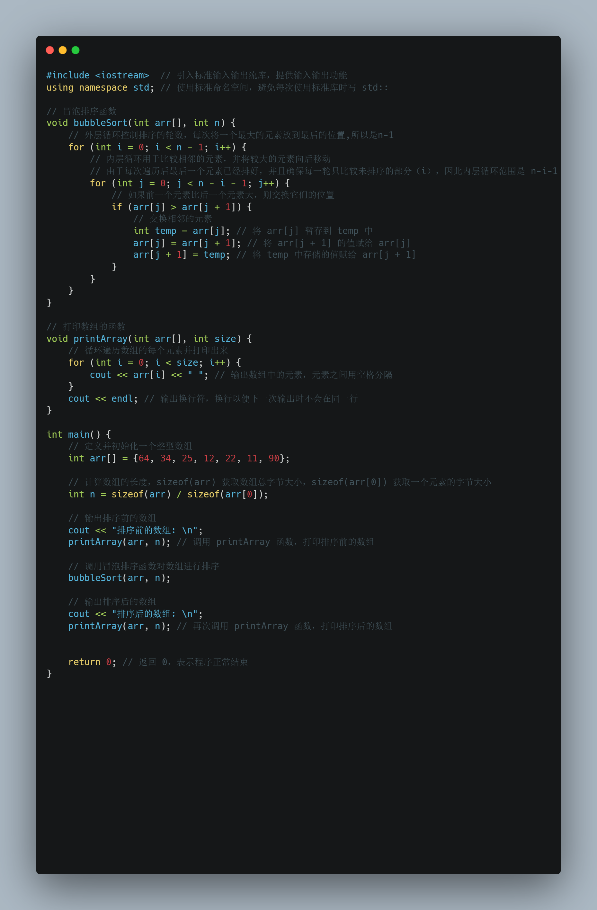
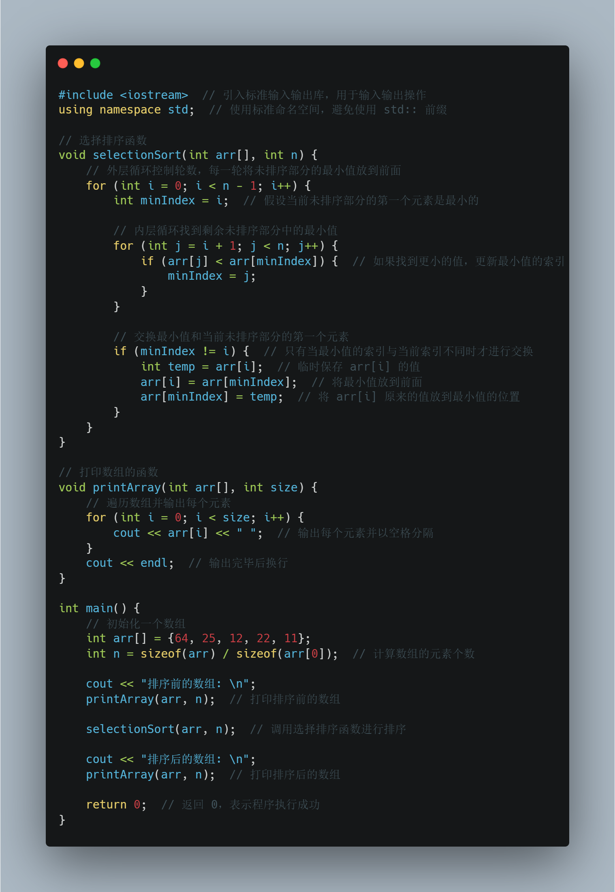

## 冒泡排序与选择排序

### 冒泡排序

基本思想是通过多次遍历数组，每次比较相邻的两个元素，将较大的元素逐渐向数组的末尾“冒泡”

```c++
#include <iostream>  // 引入标准输入输出流库，提供输入输出功能
using namespace std; // 使用标准命名空间，避免每次使用标准库时写 std::

// 冒泡排序函数
void bubbleSort(int arr[], int n) {
    // 外层循环控制排序的轮数，每次将一个最大的元素放到最后的位置,所以是n-1
    for (int i = 0; i < n - 1; i++) {
        // 内层循环用于比较相邻的元素，并将较大的元素向后移动
        // 由于每次遍历后最后一个元素已经排好，并且确保每一轮只比较未排序的部分（i），因此内层循环范围是 n-i-1
        for (int j = 0; j < n - i - 1; j++) {
            // 如果前一个元素比后一个元素大，则交换它们的位置
            if (arr[j] > arr[j + 1]) {
                // 交换相邻的元素
                int temp = arr[j]; // 将 arr[j] 暂存到 temp 中
                arr[j] = arr[j + 1]; // 将 arr[j + 1] 的值赋给 arr[j]
                arr[j + 1] = temp; // 将 temp 中存储的值赋给 arr[j + 1]
            }
        }
    }
}

// 打印数组的函数
void printArray(int arr[], int size) {
    // 循环遍历数组的每个元素并打印出来
    for (int i = 0; i < size; i++) {
        cout << arr[i] << " "; // 输出数组中的元素，元素之间用空格分隔
    }
    cout << endl; // 输出换行符，换行以便下一次输出时不会在同一行
}

int main() {
    // 定义并初始化一个整型数组
    int arr[] = {64, 34, 25, 12, 22, 11, 90};

    // 计算数组的长度，sizeof(arr) 获取数组总字节大小，sizeof(arr[0]) 获取一个元素的字节大小
    int n = sizeof(arr) / sizeof(arr[0]);

    // 输出排序前的数组
    cout << "排序前的数组: \n";
    printArray(arr, n); // 调用 printArray 函数，打印排序前的数组

    // 调用冒泡排序函数对数组进行排序
    bubbleSort(arr, n);

    // 输出排序后的数组
    cout << "排序后的数组: \n";
    printArray(arr, n); // 再次调用 printArray 函数，打印排序后的数组
    

    return 0; // 返回 0，表示程序正常结束
}

```



### 选择排序

选择排序通过不断选择未排序部分的最小元素并将其放置到前面，或者选择最大元素放在最后面，最终完成整个数组的排序

```c++
#include <iostream>  // 引入标准输入输出库，用于输入输出操作
using namespace std;  // 使用标准命名空间，避免使用 std:: 前缀

// 选择排序函数
void selectionSort(int arr[], int n) {
    // 外层循环控制轮数，每一轮将未排序部分的最小值放到前面
    for (int i = 0; i < n - 1; i++) {
        int minIndex = i;  // 假设当前未排序部分的第一个元素是最小的

        // 内层循环找到剩余未排序部分中的最小值
        for (int j = i + 1; j < n; j++) {
            if (arr[j] < arr[minIndex]) {  // 如果找到更小的值，更新最小值的索引
                minIndex = j;
            }
        }

        // 交换最小值和当前未排序部分的第一个元素
        if (minIndex != i) {  // 只有当最小值的索引与当前索引不同时才进行交换
            int temp = arr[i];  // 临时保存 arr[i] 的值
            arr[i] = arr[minIndex];  // 将最小值放到前面
            arr[minIndex] = temp;  // 将 arr[i] 原来的值放到最小值的位置
        }
    }
}

// 打印数组的函数
void printArray(int arr[], int size) {
    // 遍历数组并输出每个元素
    for (int i = 0; i < size; i++) {
        cout << arr[i] << " ";  // 输出每个元素并以空格分隔
    }
    cout << endl;  // 输出完毕后换行
}

int main() {
    // 初始化一个数组
    int arr[] = {64, 25, 12, 22, 11};
    int n = sizeof(arr) / sizeof(arr[0]);  // 计算数组的元素个数

    cout << "排序前的数组: \n";
    printArray(arr, n);  // 打印排序前的数组

    selectionSort(arr, n);  // 调用选择排序函数进行排序

    cout << "排序后的数组: \n";
    printArray(arr, n);  // 打印排序后的数组

    return 0;  // 返回 0，表示程序执行成功
}

```

